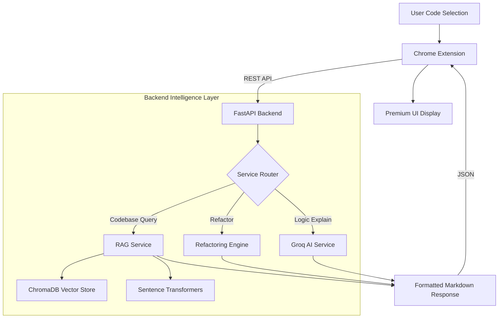

# 🚀 CodeExplainer: AI-Powered Developer Intelligence

[](https://fastapi.tiangolo.com/)
[](https://groq.com/)
[](https://developer.chrome.com/docs/extensions/)
[](https://www.trychroma.com/)

**CodeExplainer** is a premium, AI-driven developer tool designed to simplify complex codebases. Seamlessly integrated as a Chrome Extension, it leverages state-of-the-art LLMs (Llama 3.1 via Groq) and RAG (Retrieval-Augmented Generation) to explain, refactor, and analyze code directly within your browser or local environment.

---

## ✨ Key Features

- **🔍 Intelligent Code Explanation**: Instantly break down complex functions, algorithms, and logic into human-readable steps.
- **🛠️ Smart Refactoring**: Get AI-powered suggestions to optimize your code for better performance, readability, and modern standards.
- **📂 Codebase Intelligence (RAG)**: Ask questions about your entire project. The system indexes your local files and provides context-aware answers.
- **🌍 Multi-Language Support**: Explain and refactor code in multiple natural languages and programming languages.
- **⚡ Zero-Friction UI**: A minimalist, high-performance Chrome Extension popup designed for developers.

---

## 🏗️ System Architecture

The project is split into two main components: a **Chrome Extension (Frontend)** and a **FastAPI Backend (Intelligence Layer)**.



---

## 🛠️ Technical Stack

### **Frontend (Chrome Extension)**
- **Framework**: Manifest V3
- **Logic**: Javascript (ES6+)
- **Styling**: Vanilla CSS (Modern, Minimalist Design)
- **Communication**: Fetch API for RESTful integration

### **Backend (Intelligence Server)**
- **Web Framework**: FastAPI (Python)
- **AI Model**: Llama 3.1 (via Groq API)
- **Vector Database**: ChromaDB
- **Embeddings**: Sentence Transformers (Local indexing)
- **Environment**: Pydantic, Python-Dotenv, Uvicorn

---

## 🚦 Technical Flow

1.  **Context Capture**: The extension captures the user's selected code or project path via the context menu or popup interface.
2.  **Request Dispatch**: Data is sent via a `POST` request to specific FastAPI endpoints (`/explain`, `/refactor`, `/codebase`).
3.  **Core Processing**:
    *   **Direct Logic**: For snippets, the Llama model processes the raw code with a specialized system prompt to extract intent and logic.
    *   **RAG Flow**: For codebase analysis, the system retrieves relevant code chunks from ChromaDB based on embedding similarity before querying Groq, providing "long-term memory" of the project.
4.  **Generation**: The AI generates a structured, markdown-compatible explanation or refactor.
5.  **Rendering**: The extension receives the JSON response and renders it into a clean, syntax-highlighted interface for the user.

---

## 🚀 Installation & Setup

### **1. Backend Configuration**
Navigate to the `backend` directory:
```bash
cd backend
```
Create a virtual environment:
```bash
python -m venv venv
venv\Scripts\activate  # Windows
```
Install dependencies:
```bash
pip install -r requirements.txt
```
Set up your environment variables in `.env`:
```env
GROQ_API_KEY=your_actual_groq_key_here
```
Start the API:
```bash
python app.py
```

### **2. Extension Installation**
1. Open Chrome and go to `chrome://extensions/`.
2. Enable **Developer mode**.
3. Click **Load unpacked** and select the `extension` folder in this repository.

---

## 🔌 API Reference

| Endpoint | Method | Payload | Description |
| :--- | :--- | :--- | :--- |
| `/explain` | `POST` | `{code, language}` | Explains a selected code snippet. |
| `/refactor` | `POST` | `{code, language}` | Provides an optimized version of the code. |
| `/codebase` | `POST` | `{repo_path, language}`| Analyzes an entire repository using RAG. |

---
